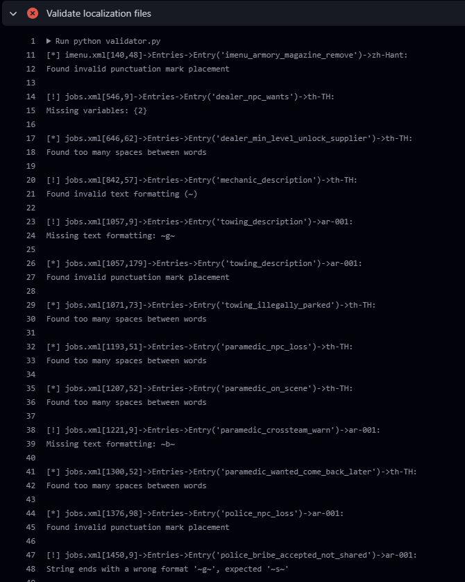

# CnR V Localization

This repository contains the necessary files for the localization of CnR. 

## Setup

### Download and Install the Required Software

- [Visual Studio Code](https://code.visualstudio.com/download)
- [Git](https://git-scm.com/download/)

### Clone the Repository

- Open VSCode
- Select `File > Open Folder`
- Navigate to a folder of your liking
- Then select `Terminal > New Terminal`
- Run the following command: `git clone https://github.com/Sasino97/gta-cnr-localization.git`

## Usage of the Git repository

We use Git to manage the teamwork of this repository. To make everything easier, we don't use the command line interface directly unless strictly necessary, and we prefer to rely on VSCode's GUI which is much more user-friendly and easy to understand. We also don't make use of branches, pull requests and similar features, to streamline the process and avoid adding unnecessary complications.

This is the correct routine for a normal work session:

- Open VSCode
- Switch to the Source Control tab (the 3rd from the top, or press Ctrl+Shift+G)
- Sync other people's changes (click the sync icon)
- If you get merge conflicts, please resolve them, then commit (without changing the commmit text please, leave "Merge branch 'master' of https://github.com/Sasino97/gta-cnr-localization")
- Make sure your repository is clean (nothing to pull, nothing to commit)
- Work
- Go back to the Source Control tab
- Commit your work (with a short description of your changes)
- Sync your changes (click the sync icon again)

## Troubleshooting

### Missing permissions?

Login to GitHub by following the steps on screen, make sure to use the same account that has access to this page.

### Must set username/email before committing?

- In a VSCode Terminal, run `git config --global user.name "USERNAME"`
- Then `git config --global user.email "NAME@EXAMPLE.COM"`

Obviously, replace those placeholders with your actual data.

### Clean repository tree before checking out

When you get this error:


You simply need to make a commit before syncing/pulling.

### Merge conflicts

This should not happen unless you have edited the same line which is unlikely in this type of work. But just in case, if you have a merge conflict, open the file, make sure to correctly merge your changes and the other person's change without damaging neither.

Let's say for example that the other person had made a mistake in the xml:lang attribute and you spotted it and fixed it for them, so you changed the wrong `de_DE` to the correct `de-DE`, but before you committed and they pulled your change, they have made a different change to the same line, let's say they changed `Rache` to `Revenge`. In that case, a merge would look like this:

```
<<<<<< HEAD (Current change)
        <String xml:lang="en-US">Revenge information</String>
        <String xml:lang="de-DE">Rache Informationen</String>
======
        <String xml:lang="en-US">Revenge information</String>
        <String xml:lang="de_DE">Revenge Informationen</String>
>>>>>> some_long_ahh_number (Incoming Change)
```

Note: I have removed some of the special characters (`<`, `>`, `=`) otherwise Git will actually recognize it as an unmerged part of this document.

How it should look after you merge the changes:
```
        <String xml:lang="en-US">Revenge information</String>
        <String xml:lang="de-DE">Revenge Informationen</String>
```

You kept both your change and their change.
If you are in doubt, keep their changes instead!

After you merged, you need to right click on the file and "Stage" it.

### Validation errors
When you push your changes to the Github repository, sometimes you will see a red ❌ icon near your last commit.

This means that your commit (or a commit before yours) has introduced errors, and you should fix.

Click on the ❌ then click on "Details".


In the details page, you will see a detailed list of errors that looks like this.



Each error in the list tells you:
- File name
- Line and position
- Id of the string
- Language where there's a problem
- Description of the error

You should do your best to understand and correct the error, but if you can't you can ask in the forum and others will help you.

### Still need help?

We are here to help, just make a thread in `#lang-forum` and whoever has an answer will help you out.

## Format

The file format utilized for translations is XML (Extensible Markup Language). You can learn more about XML on [Wikipedia](https://en.wikipedia.org/wiki/XML). We will use a different XML file for each category, to have better separation.

## Index.json

Every new XML file that gets added to the project must be defined in this index file which uses the JSON format instead for simplicity. The file itself is simple and self-explanatory.

## Object types

I have defined the following XML objects:

- Entry: an abstract message containing multiple strings that convey that message. The game code will use these units, then the underlying system will pick the correct string depending on the user's language.
- String: a string of characters with the actual text content to display, and a language property indicating for what language it is meant.

## Basic Structure

Each file contains a root `Entries` array. Each element of this array is an `Entry` object with an `Id` property which <b>MUST</b> be unique. In case of a duplicate ID, the parser will only take the first encountered in consideration and will ignore any subsequent duplicate. You will normally not need to worry about this, as Sasino himself will add all the entries.

Each `Entry` object then contains multiple `String` child objects, that have a `xml:lang` standard property containing the locale code (e.g. en-US) of the translation, and the actual string as its content; duplicate translations in the same language of the same `String` will be ignored.

## Variables

Strings can contain variables which are defined using the following bracket symbols: `{` to open and `}` to close. A variable cannot have a name, but only a number, but they can be in any order, just make sure to match them correctly if the language you are translating in doesn't follow the same sentence order.

### Example

```xml
<String xml:lang="en-US">{0} killed {1} {2}.</String>
<String xml:lang="zh-Hans">{0} {2} 杀了 {1}.</String>
```

In this example, 0 is the killer, 1 is the victim and 2 is the weapon/method of killing. I have used Chinese in this example, because in English we say

> X has killed Y with a knife

but in Chinese they say

> X 用刀杀了 Y (X with a knife has killed Y)

So this was a good example to show you how variable `{2}` is moved before `{1}` in this scenario.

### Escaping the bracket character

This is unlikely to actually happen, but if you need to actually show the `{` or `}` characters, you simply type them twice:

```xml
<String xml:lang="en-US">This is a left bracket: {{</String>
```

## Special XML characters

If you want to display the following characters literally, they <b>MUST</b> be escaped as follows:

```xml
<    &lt;
>    &gt;
&    &amp;
```

For example, you <b>cannot</b> write:

```xml
<String xml:lang="en-US">You have > 10 items</String> <!-- BAD EXAMPLE -->
```

You must replace the quotes with their appropriate escape code:

```xml
<String xml:lang="en-US">You have &gt; 10 items</String>
```

Otherwise you will break the whole XML file and it won't load. The same applies to all those characters shown above.

### Unnecessary escapes

The following characters should be escaped in a standard XML file, however, the parser we are using doesn't have issues with those, so we'll not escape them and we'll use the literal strings, for simplicity.

```
"    &quot;
'    &apos;
```

So, it's OK to write

```xml
<String xml:lang="en-US">You can't do that</String>
```

## Consistency

When you translate certain technical terms of the game, choose the best that you can choose, a term that applies in all cases, and then stick to it. For example, if you choose to translate `Inventory` in a certain way, then stick to that term in all the translation, don't suddenly change it to `Backpack` or `Pocket` in other parts of the UI.

## Comments

Have you ever found one of those websites where something is grammatically correct but it makes no sense in that context? Well, whether you have encountered such a website or not, we definitely don't want to commit that mistake, that's why there are comments in the code, and you can add your own if you think they are necessary.

This is a simple comment in XML

```xml
<!-- This string is shown when the player opens the main menu -->
```

It explains to translators and all readers what the intentions of the original author of that portion of code were.

Then we have section comments:

```xml
    <!-- ========================= -->
    <!-- Kill Messages -->
    <!-- ========================= -->
```

These delimit different categories of message inside the same file, and help keep it organized.

## GTA Formatting

### New Lines
New lines are represented with either `\n` or `~n~`. These special character combinations are interpreted as a new line by the game.

### Colors

Sometimes you will find strings that contain symbols like the following: `~r~`. This simply means that from there on, the string will become red. Another common one is `~s~`, which will erase color formatting and return to the default color (white or black depending on the background). That how GTA color coding works, and we make extensive use of those in CnR because we have used the native GUI of GTA V a lot, and that's the way colors are coded.

When you are translating from English to another language and there is color formatting, you need to try to best of your ability to colorize the corresponding words, and not to change the colors to other colors.

[List of GTA Colors](https://wiki.rage.mp/index.php?title=Fonts_and_Colors#GTA_Colors).

### Highlighting

Text can also be highlighted with the `(C)(/C)` tags.

```xml
(C)WORD TO HIGHLIGHT(/C)
```

[Highlighting](https://wiki.rage.mp/index.php?title=Fonts_and_Colors#Highlighting)

## Used ISO Language Codes

- English (US): `en-US`
- German (Germany): `de-DE`
- French (France): `fr-FR`
- Dutch (Netherlands): `nl-NL`
- Italian (Italy): `it-IT`
- Spanish (Spain-Latam): `es-ES`
- Portuguese (Brazil): `pt-BR`
- Polish (Poland): `pl-PL`
- Turkish (Turkey): `tr-TR`
- Arabic (Modern Standard): `ar-001`
- Chinese (Simplified): `zh-Hans`
- Chinese (Traditional): `zh-Hant`
- Vietnamese (Vietnam): `vi-VN`
- Thai (Thailand): `th-TH`
- Indonesian (Indonesia): `id-ID`
